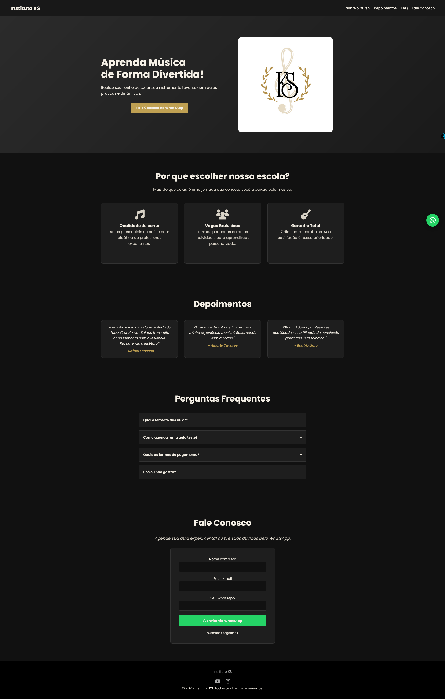

# Instituto KS - Escola de Música

> Projeto de uma escola de música online e presencial com cursos interativos, FAQ e formulário de contato via WhatsApp. Interface moderna e responsiva para todos os dispositivos.

### 🔄 Ajustes e melhorias

O projeto ainda está em desenvolvimento e as próximas atualizações serão voltadas para as seguintes tarefas:

- [x] Estrutura do site com HTML semântico
- [x] Estilização principal com CSS3 e variáveis
- [x] Responsividade para desktop, tablet e mobile
- [ ] Implementação de efeitos de animação avançados
- [ ] Otimização de SEO e performance
- [ ] Adição de novas seções de cursos e depoimentos
- [ ] Adição de um backend para gerenciar cursos, depoimentos e contatos via WhatsApp**

## 💻 Pré-requisitos

Antes de começar, verifique se você atendeu aos seguintes requisitos:

- Você instalou a versão mais recente do navegador Google Chrome, Firefox ou Edge.
- Você tem uma máquina Windows, Linux ou Mac.
- Você leu a documentação básica sobre HTML, CSS e JavaScript.

## 😄 Seja um dos contribuidores
- Quer fazer parte desse projeto? Clique AQUI e leia como contribuir.
